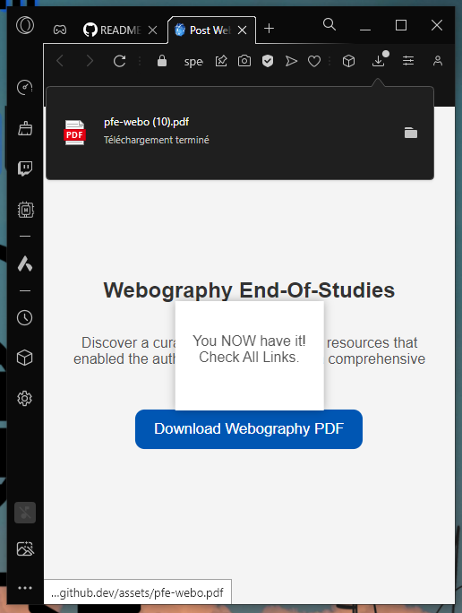

# The DevSecMaps Webography

This project serves as a straightforward DevSecMap Webography content grabber. 

In this instance, I'm sharing my webography, which outlines the resources I used to complete my end-of-study project. 

Additionally, we've incorporated a popup function to enhance the interactive experience after performing the action.

> Feel free to truly explore and gain additional insights.

|ℹ️|Do you wish to gain the complete detailed report and its invaluable wisdom that I've painstakingly gathered through my trials and tribulations?|
|---|:---|
|🗝️|Connect and [tell me that in LinkedIn](https://www.linkedin.com/in/yahya-abulhaj/) via a DM, pleasure to share it all to you personally.|

